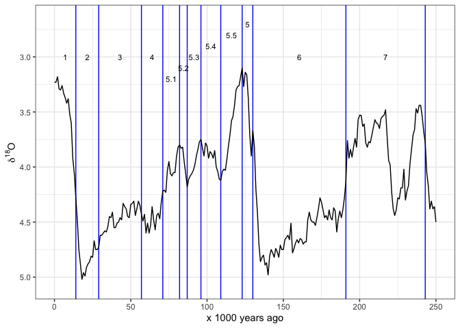
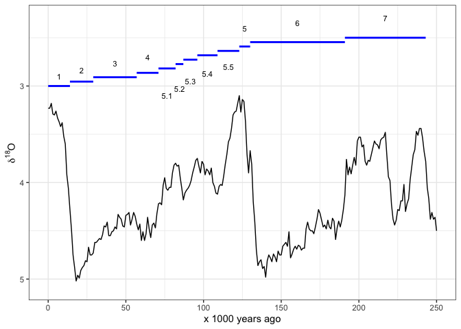
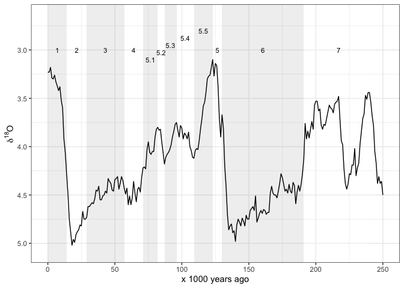
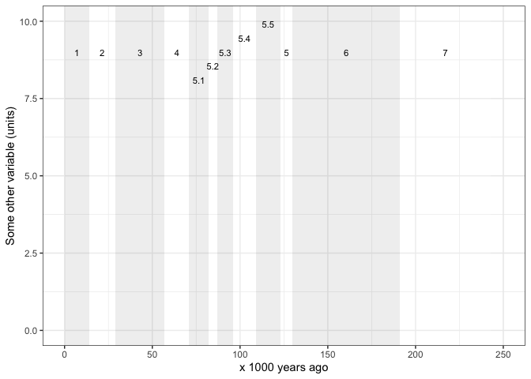

<!-- README.md is generated from README.Rmd. Please edit that file -->
gsloid: global sea level and oxygen isotope data
================================================

[](https://travis-ci.org/benmarwick/gsloid)

The goal of gsloid is to make available raw data for sea level curves and *δ*<sup>18</sup>O curves for the Holocene and most of the Pleistocene.

Installation
------------

You can install gsloid from github with:

``` r
# install.packages("devtools")
devtools::install_github("benmarwick/gsloid")
```

Overview
--------

This package includes commonly used datasets in palaeoecology and archaeology:

-   Global sea level curve
-   Global oxygen isotope curve
-   Boundary ages for Marine Isotope Stages

There are many possible sources for these kinds of data, this package includes data from:

| Dataset      | Source                                                                                                                                                                                       |
|:-------------|:---------------------------------------------------------------------------------------------------------------------------------------------------------------------------------------------|
| lisiecki2005 | Lisiecki, L.E. and M.E. Raymo. 2005. A Pliocene-Pleistocene stack of 57 globally distributed benthic D18O records. Paleoceanography, Vol. 20, PA1003, <https://doi.org/10.1029/2004PA001071> |
| spratt2016   | Spratt, Rachel M. and Lorraine E. Lisiecki 2016. A Late Pleistocene sea level stack. Climate of the Past. Vol. 12, 1079-1092, <https://doi.org/10.5194/cp-12-1-2016>                         |

You **must** cite those sources in the table above if you use the data in this package.

Here's the structure of the main data sets:

``` r
library(gsloid)
str(lisiecki2005)
#> 'data.frame':    2115 obs. of  3 variables:
#>  $ Time : num  0 1 2 3 4 5 6 7 8 9 ...
#>  $ d18O : num  3.23 3.23 3.18 3.29 3.3 3.26 3.33 3.37 3.42 3.38 ...
#>  $ Error: num  0.03 0.04 0.03 0.03 0.03 0.03 0.04 0.04 0.03 0.04 ...
```

``` r
str(spratt2016)
#> 'data.frame':    799 obs. of  9 variables:
#>  $ age_calkaBP            : num  0 1 2 3 4 5 6 7 8 9 ...
#>  $ SeaLev_shortPC1        : num  8.49 7.63 4.01 4.35 3.13 ...
#>  $ SeaLev_shortPC1_err_sig: num  5.23 4.87 4.83 4.72 4.74 4.57 5.04 5.9 6.79 8.3 ...
#>  $ SeaLev_shortPC1_err_lo : num  -1.72 -2.9 -4.51 -6.93 -10.43 ...
#>  $ SeaLev_shortPC1_err_up : num  17.93 16.39 13.59 12.08 8.41 ...
#>  $ SeaLev_longPC1         : num  8.96 7.72 5.96 3.54 1.88 0 -2 -5.38 -7.12 -11.6 ...
#>  $ SeaLev_longPC1_err_sig : num  5.72 5.13 4.69 4.42 4.39 ...
#>  $ SeaLev_longPC1_err_lo  : num  -1.21 -2.77 -5.01 -7.28 -10.54 ...
#>  $ SeaLev_longPC1_err_up  : num  20.38 17.1 14.21 10.9 7.63 ...
```

``` r
str(LR04_MISboundaries)
#> 'data.frame':    232 obs. of  7 variables:
#>  $ MIS_Boundary     : chr  "1/2" "2/3" "3/4" "4/5" ...
#>  $ start_MIS        : chr  "1" "2" "3" "4" ...
#>  $ end_MIS          : chr  "2" "3" "4" "5" ...
#>  $ label_MIS        : chr  "1" "2" "3" "4" ...
#>  $ LR04_Age_ka_start: num  14 29 57 71 82 87 96 109 123 130 ...
#>  $ LR04_Age_ka_end  : num  0 14 29 57 71 82 87 96 109 123 ...
#>  $ LR04_Age_ka_mid  : num  7 21.5 43 64 76.5 ...
```

Detailed descriptions of the variables are avaliable in the data documentation, run `?lisiecki2005`, `?spratt2016` and `?LR04_MISboundaries` for more information.

Usage
-----

Atlhough these data are suitable for many kinds of analyses, the primary reason that I made this package is so I can easily make my own plots of these data. Here's how I typically start with plotting the oxygen isotope data. I have set limits on the x-axis so it only shows 0-250 ka because that's what I'm interested in:

``` r
library(ggplot2)


ggplot(lisiecki2005, 
       aes(Time,
           d18O)) +
  geom_line() +
  scale_x_continuous(limits = c(0, 250),
                     name = "x 1000 years ago") +
  scale_y_reverse(name = bquote(delta^18*O)) +
  theme_bw()
```


And here's how I start to plot the sea level data:

``` r
ggplot(spratt2016, 
       aes(age_calkaBP,
           SeaLev_shortPC1)) +
  geom_line() +
  scale_x_continuous(limits = c(0, 250),
                     name = "x 1000 years ago") +
  scale_y_continuous(name = "Sea Level, meters above present day") +
  theme_bw()
```


Often we want to see the Marine istope stages on these plots also. This package includes the dataset `LR04_MISboundaries` of start and end dates for each stage, so we can draw these stages easily. I obtained these data from Lorraine Lisiecki's web page: <http://lorraine-lisiecki.com/LR04_MISboundaries.txt>

Some care is required to get the MIS numbers positions in easy-to-read locations. Here I use `rep()` and `seq()` to help position the numbers.

``` r
# subset the MIS data for the last 250 ka years
mis_last_250ka <- LR04_MISboundaries[LR04_MISboundaries$LR04_Age_ka_start <= 250, ]

# plot the oxygen istope data line on top of the MIS lines
ggplot() +
  geom_vline(data = mis_last_250ka,          # add MIS lines
             aes(xintercept = LR04_Age_ka_start),
             colour = "blue") +
  annotate("text", 
           label = mis_last_250ka$label_MIS, 
           x = mis_last_250ka$LR04_Age_ka_mid,
           y = c(rep(3.0, 4), 
                 seq(3.2, 2.7, length.out = 6), 
                 rep(3.0, 2)),
           size = 3) +
  geom_line(data = lisiecki2005,                # add d18O line
            aes(Time,
                d18O)) +  
  scale_x_continuous(limits = c(0, 250),
                     name = "x 1000 years ago") +
  scale_y_reverse(name = bquote(delta^18*O)) +
  theme_bw()
```



Sometimes we prefer to indicate the MIS by horizontal lines. Once again we have to carefully place the line segments and labels so they are clear to read:

``` r
ggplot() +
  geom_segment(data = mis_last_250ka, # add MIS lines
               aes(x =    LR04_Age_ka_end,
                   xend = LR04_Age_ka_start,
                   y =    seq(3, 2.5, length.out = nrow(mis_last_250ka)),
                   yend = seq(3, 2.5, length.out = nrow(mis_last_250ka))),
               colour = "blue",
               size = 1) +
  annotate("text", 
           label = mis_last_250ka$label_MIS, 
           x =     mis_last_250ka$LR04_Age_ka_mid,
           y = c(seq(2.9, 2.7, length.out = 4), 
                 seq(3.1, 2.8, length.out = 5),
                 seq(2.4, 2.3, length.out = 3)),
           size = 3) +
  geom_line(data = lisiecki2005,                # add d18O line
            aes(Time,
                d18O)) +  
  scale_x_continuous(limits = c(0, 250),
                     name = "x 1000 years ago") +
  scale_y_reverse(name = bquote(delta^18*O)) +
  theme_bw()
```



And sometimes we might want shaded rectangles to indicate the MIS:

``` r
ggplot() +
  annotate("rect", 
           xmin = mis_last_250ka$LR04_Age_ka_end, 
           xmax = mis_last_250ka$LR04_Age_ka_start, 
           ymin = -Inf, 
           ymax = Inf,
        alpha = .2,
        fill = rep(c("grey70", "white"), 
                   nrow(mis_last_250ka)/2)) +
  annotate("text", 
           label = mis_last_250ka$label_MIS, 
           x =     mis_last_250ka$LR04_Age_ka_mid,
           y = c(rep(3, 4), 
                 seq(3.1, 2.8, length.out = 5),
                 rep(3, 3)),
           size = 3) +
  geom_line(data = lisiecki2005,                # add d18O line
            aes(Time,
                d18O)) +  
  scale_x_continuous(limits = c(0, 250),
                     name = "x 1000 years ago") +
  scale_y_reverse(name = bquote(delta^18*O)) +
  theme_bw()
```



Maybe we want the MIS regions by themselves so we can plot some other time series besides the ones includes here. We need to adjust the `y` values in the `annotate()` function to ensure that the MIS labels show in a readble way. Here I show an imaginary variable that might have a maximum value of about 10. So I adjust the `y` values in the `annotate()` function to position the MIS labels just below 10 on the y axis.

``` r
ggplot() +
  annotate("rect", 
           xmin = mis_last_250ka$LR04_Age_ka_end , 
           xmax = mis_last_250ka$LR04_Age_ka_start, 
           ymin = -Inf, 
           ymax = Inf,
        alpha = .2,
        fill = rep(c("grey70", "white"), 
                   nrow(mis_last_250ka)/2)) +
  annotate("text", 
           label = mis_last_250ka$label_MIS, 
           x =     mis_last_250ka$LR04_Age_ka_mid, 
           y = c(rep(9, 4), 
                 seq(8.1, 9.9, length.out = 5),
                 rep(9, 3)),
           size = 3) +
  # add in other geoms here...
  scale_x_continuous(limits = c(0, 250),
                     name = "x 1000 years ago") +
  scale_y_continuous(limits = c(0, 10),
                  name = "Some other variable (units)") +
  theme_bw()
```



Please note that this project is released with a [Contributor Code of Conduct](CONDUCT.md). By participating in this project you agree to abide by its terms.
